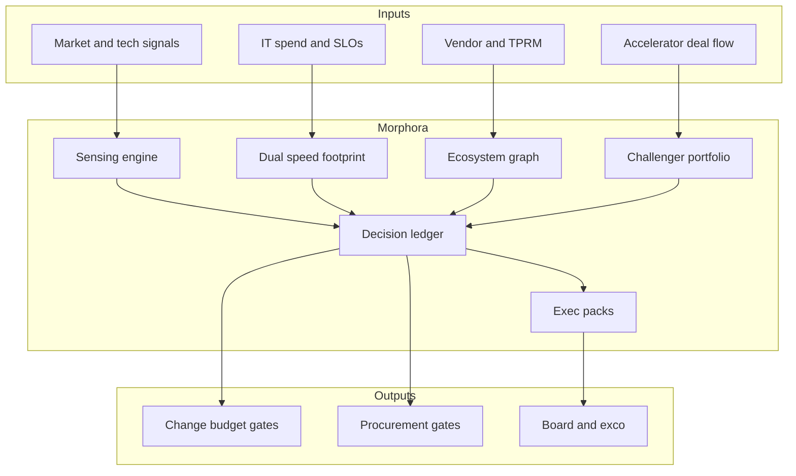

# Morphora

**Source:** `ai-in-financial/deloitte-gx-shapeshifters-changing-of-CIO-financial-services/`
**Domain:** `ai-fin`
**One-liner:** A dual-speed CIO operating system that turns Deloitte’s four “shapeshifter” roles—strategist, legacy–modern bridge, ecosystem orchestrator, and start-up leader—into living portfolios, sensing engines, and executive rituals for financial-services technology leaders.
**Wedge:** FS CIOs and their chiefs of staff at incumbent banks and insurers who are stuck as “trusted operators” (Deloitte: >50% of CIOs) and need a practical operating model to become digital vanguards (<10%) without abandoning core reliability.
**Positioning:** CIO agenda and shapeshifter operating model—not an AI use-case catalogue (Portiva) and not post-trade infrastructure (Settora). The Shapeshifters brief argues IT is now the catalyst for competitive advantage; Morphora is the control plane for how the CIO leads strategy, dual-speed delivery, ecosystems, and challenger innovation.

## Market research synthesis

### Thesis from source

*Shapeshifters: The changing of the CIO in financial services* describes a stretch-and-squeeze on incumbents. Squeeze: customers conditioned by Amazon/Facebook-grade experiences, PayPal/Betterment-style disruptors, and evolving data regulation. Stretch: FinTech investment nearly tripled in 2014 to US$12.2B, with continuous innovation in payments, fraud, planning, and cost saving; data is the new competitive currency trapped in legacy systems. Deloitte’s 2018 global CIO survey: more than half of CIOs remain trusted operators focused on efficiency, reliability, and cost; fewer than 10% are digital vanguards aligning business and digital strategy.

Four expanded roles define the future CIO. **Strategist and visionary:** lead business strategy with sensing engines—small teams that assess emerging tech (cloud, AI, blockchain, quantum), trends, and alliance partners to separate hype from reality; reshape IT delivery for risk/agility balance (“IT at the right speed”); win the talent war via continuous learning. **Bridge past and future:** WEF/Deloitte AI ecosystem work is cited that 75–80% of bank IT spend maintains core systems; CIOs must decide what to modernise vs scrap, operate at two speeds (start-up innovation plus careful legacy stewardship), and stop vendors or lines of business from dictating reactionary priorities. **Ecosystem orchestrator:** manage plug-and-play procurement across cloud, vendors, start-ups, alliances, open source; collaborate with CDO/CInnoO/CDataO/CCustomerO and cross-industry partners; act as hype-filter so adoption fits objectives. **Start-up leader:** Agile delivery; buy/rent/partner vs build only for true differentiators; incubators/accelerators, internal FinTech funds, and champion/challenger business constructs; cross-functional teams delivering small testable increments.

Morphora productises these roles as linked operating artefacts: a sensing backlog, a dual-speed investment map of the core footprint, an ecosystem partner graph with hype scores, and a challenger/innovation portfolio with kill-or-scale rituals—under the same fiscal/operational accountability CIOs never shed.

### Buyer & economic model

- **Primary buyer:** Chief Information Officer (or Group CTO) in banking, capital markets, or insurance.
- **Users:** CIO chief of staff / IT strategy, enterprise architects, vendor management, innovation/accelerator leads, business unit CTOs, CFO partners for IT spend, risk partners for third-party concentration.
- **Budget owner / value metric:** technology budget (run vs change). Value metrics: share of spend on change vs the 75–80% run trap; time from sensing signal to executive decision; % innovation items with explicit build/buy/partner choice; reduction in unmanaged shadow IT; talent critical-role coverage.
- **Competing status quo:** annual budget theatre; vendor roadmaps as strategy; innovation labs disconnected from core; Excel dual-speed narratives; no hype filter.

### Domain constraints

- **Regulatory / trust / safety:** operational resilience, outsourcing/third-party risk, concentration in cloud providers, auditability of technology decisions affecting customer outcomes.
- **Data sensitivity:** strategy and vendor scores are competitively sensitive; partner due diligence contains confidential assessments.
- **Change-management realities:** trusted-operator culture resists strategy ownership; business units protect pet vendors; Morphora must make dual-speed trade-offs explicit and board-visible.

## Business requirements

- BR-1: Every material technology initiative must map to at least one shapeshifter role outcome (strategy, bridge, ecosystem, start-up) and a named business sponsor.
- BR-2: The core IT footprint must be inventoried with modernise / adapt / replace / retire dispositions and dual-speed funding tags (run-careful vs change-fast).
- BR-3: A sensing engine backlog must capture emerging tech and alliance signals with hype-vs-reality assessments before executive sponsorship.
- BR-4: Build vs buy vs rent vs partner decisions must be recorded for capabilities claimed as strategic differentiators versus commodity.
- BR-5: Ecosystem partners must be graphed with concentration and criticality scores; single points of failure must surface at portfolio level.
- BR-6: Challenger/innovation items must have testable increments and kill/scale criteria; labs without criteria cannot remain “strategic” indefinitely.
- BR-7: Run-the-bank reliability SLOs remain visible alongside innovation KPIs so strategy gains cannot hide operational regression.
- BR-8: Talent critical roles for dual-speed delivery must be attached to the roadmap with coverage gaps flagged.
- BR-9: Hype-filter decisions (adopt / watch / reject) must be immutable with rationale when executives override sensing recommendations.
- BR-10: Shadow IT discovered outside the dual-speed map must open remediation cases.
- BR-11: Board/exco packs must show stretch/squeeze context, spend mix, ecosystem concentration, and challenger outcomes in one narrative.
- BR-12: Morphora governs CIO operating decisions—it does not execute customer financial transactions or replace enterprise architecture tooling wholesale.

## User stories

Canonical user stories live in sibling [USER_STORIES.md](USER_STORIES.md).

## System design

### Overview

Morphora is an operating system for the FS CIO office: sensing intake, dual-speed footprint planning, ecosystem graphing, challenger portfolio management, and executive pack generation. Integrations pull spend, incidents, and vendor inventories; humans own all adopt/kill/scale decisions.

### Actors & boundaries

- **Actors:** CIO, chief of staff, architects, vendor/ecosystem managers, innovation leads, CFO/risk partners, business sponsors.
- **Trust boundary:** internal strategy confidentiality; partners do not see competitive scoring of peers.
- **Human-in-the-loop points:** hype-filter outcomes; footprint dispositions; partner criticality ratings; challenger kill/scale; board pack publish.

### Core capabilities

1. **Shapeshifter role dashboard** — weekly operating rhythm across four roles.
2. **Sensing engine backlog** — tech/alliance signals and hype assessments.
3. **Dual-speed footprint map** — core systems with dispositions and funding tags.
4. **Ecosystem partner graph** — criticality, concentration, hype-filter status.
5. **Build/buy/rent/partner registry**.
6. **Challenger innovation portfolio** — increments and kill/scale gates.
7. **Talent coverage overlay**.
8. **Shadow IT remediation cases**.
9. **Executive and board packs**.
10. **Decision ledger** — immutable CIO operating decisions.

### Conceptual data

- **Primary entities:** RoleCadence, SensingSignal, HypeAssessment, CoreSystem, SpeedTag, Disposition, Partner, ConcentrationScore, SourcingDecision, ChallengerInitiative, KillMetric, TalentGap, ShadowITCase, ExecPack, DecisionRecord.
- **Critical events:** signal filed, hype scored, disposition set, partner criticality changed, sourcing decided, challenger killed/scaled, pack published, shadow case opened.
- **Retention / audit needs:** decision ledger and board packs retained for governance lookback; vendor diligence artefacts retained per third-party policy.

### Integrations (conceptual)

- **Systems of record:** CMDB/IT asset, IT financial management, vendor management / TPRM, HR critical-role lists, incident/SLO tooling.
- **Upstream signals:** spend actuals, major incidents, vendor risk scores, accelerator deal flow.
- **Downstream actions:** budget releases, procurement gates, remediation tickets, board materials.

### High-level architecture

### Success metrics

- **Leading:** sensing items decided within SLA; % core systems with current disposition; % initiatives with sourcing decision; challenger kill enforcement rate; talent gap closure rate.
- **Lagging:** change-spend share vs maintenance trap; reduction in critical concentration breaches; shadow IT case volume down; CIO vanguard behaviours evidenced in board packs; major incident trend while change velocity rises.

## OpenAPI skeleton

Canonical HTTP surface lives in sibling [openapi.yaml](openapi.yaml). Summary:

- **Base path:** `/v1/...`
- **Auth:** Bearer JWT for CIO office; `X-API-Key` for CMDB/spend/vendor connectors.
- **Resource groups:** Sensing, Footprint, Partners, Initiatives, Decisions, Talent, Packs, Cases.
