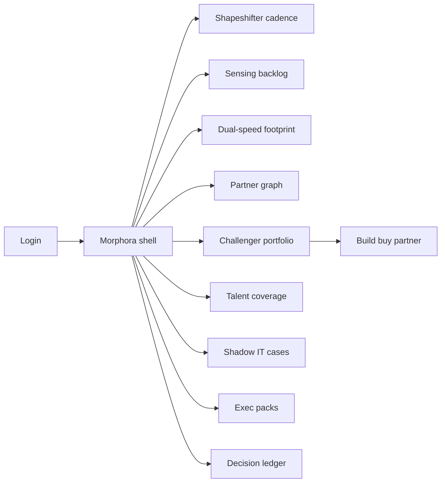
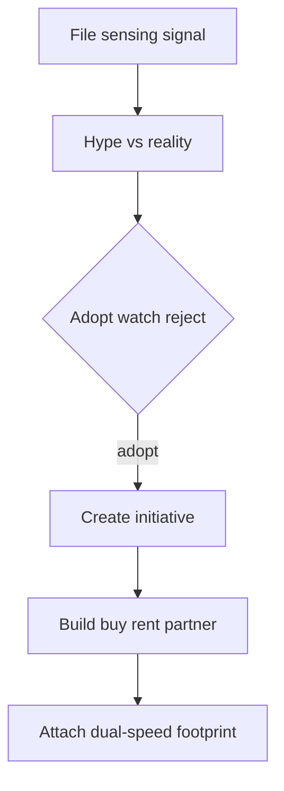

# Morphora — Web app

**Product:** [PRODUCT.md](./PRODUCT.md)
**Primary surface:** Dual-speed CIO operating system (shapeshifter cadence: sensing → footprint → ecosystem → challenger → exec packs)
**Secondary surfaces:** Board pack publisher (read-only share); shadow-IT case queue (remediation)
**Design thesis:** Morphora is the CIO’s weekly war room for becoming a digital vanguard without abandoning the core—not an AI use-case catalogue, not a trading kill switch, and not a vendor portal. The metaphor is a two-speed railway map: midnight indigo ground, signal-yellow for sensing/hype filters, steel for careful-run core, electric teal for change-fast tracks, and chalk-white decision stamps. Four shapeshifter roles appear as compass points the week must visit; labs without kill criteria fade as museum pieces. The Morphora wordmark is teal on every decision ledger entry so strategy talk stays fiscally and operationally accountable.

## UX research synthesis

### Category peers (best-in-class)

- **ServiceNow / Planview enterprise portfolio:** Initiative portfolios with funding and status. Steal: dual-speed funding tags and initiative→sponsor mapping (BR-1, BR-2); reject ITSM ticket triage as the CIO home.
- **Gartner Hype Cycle / CB Insights signal tools:** Emerging-tech assessment workflows. Steal: hype-vs-reality backlog before sponsorship (BR-3, BR-9); reject slide-only sensing with no immutable decisions.
- **Coupa / TPRM concentration dashboards:** Vendor criticality and single points of failure. Steal: partner graph with concentration breaches blocking scale (BR-5); reject procurement catalogues as strategy.
- **Internal bank innovation portfolio boards (e.g. accelerator CRM patterns):** Kill/scale rituals. Steal: testable increments and enforced kill metrics (BR-6); reject eternal “strategic lab” status.

### Patterns to adopt / reject

- **Adopt:** Four-role weekly cadence home; sensing with adopt/watch/reject stamps; core disposition map; build/buy/rent/partner registry; challenger kill gates; run SLOs beside innovation KPIs; talent gap overlay; board pack one-narrative.
- **Reject:** Trading blotter chrome; fraud queues; AutoML furnaces; AI ethics gate clones; annual budget theatre as the only rhythm.

### Trust, density, and workflow constraints from PRODUCT.md

Trusted-operator culture resists strategy ownership—Morphora must make dual-speed trade-offs board-visible. Partners must not see peer competitive scores. Morphora governs CIO decisions; it does not execute customer financial transactions (BR-12).

## Information architecture

### Nav model

### Roles → default home

| Role | Default home | Why |
|------|--------------|-----|
| CIO | Shapeshifter cadence | Weekly four-role rhythm |
| Chief of staff | Cadence + packs | Decisions not decks |
| Enterprise architect | Dual-speed footprint | Modernise/replace dispositions |
| Ecosystem / vendor lead | Partner graph | Concentration + hype gates |
| Innovation lead | Challenger portfolio | Kill/scale criteria |
| CFO / risk partner | Spend mix + concentration | Fiscal and resilience |

### Cross-links to OpenAPI resources

| Nav area | OpenAPI tags / resources |
|----------|---------------------------|
| Emerging tech signals | Sensing |
| Core systems / dispositions | Footprint |
| Ecosystem graph | Partners |
| Challenger / sourcing | Initiatives |
| Immutable CIO decisions | Decisions |
| Critical-role gaps | Talent |
| Board / exco | Packs |
| Shadow IT remediation | Cases |

## Screen inventory

### Shapeshifter cadence home

- **Purpose:** Run the CIO week against strategist, bridge, ecosystem, start-up—not ticket triage.
- **Entry:** CIO / CoS default.
- **Layout regions:** Four compass panels with this-week ritual status; stretch/squeeze headline; run vs change spend vs 75–80% trap; next decisions due.
- **Primary actions:** Open sensing item; open footprint conflict; publish pack draft; jump to overdue kills.
- **Empty / loading / error:** Empty = seed first sensing + footprint import; error = spend connector lag.
- **BR / story ties:** BR-1, BR-7, BR-11; CIO stories.

### Sensing backlog

- **Purpose:** Capture emerging tech/alliance signals with hype-vs-reality before sponsorship.
- **Entry:** Strategist role; CoS.
- **Layout regions:** Signal queue; hype score; assessment notes; adopt/watch/reject recommendation; override rationale field.
- **Primary actions:** File signal; score hype; stamp decision (immutable); escalate to exco.
- **Empty / loading / error:** Unscored signals cannot get budget (BR-3, BR-9).
- **BR / story ties:** BR-3, BR-9.

### Dual-speed footprint map

- **Purpose:** Inventory core with modernise/adapt/replace/retire and run-careful vs change-fast tags.
- **Entry:** Architect default.
- **Layout regions:** System map; disposition chips; dependency edges; coupling warnings when change-fast touches careful-run; funding tags.
- **Primary actions:** Set disposition; declare coupling; flag brittle change.
- **Empty / loading / error:** Untagged systems block change releases (BR-2).
- **BR / story ties:** BR-2; architect stories.

### Ecosystem partner graph

- **Purpose:** Criticality and concentration; SPOFs at portfolio level; hype-filter tied to procurement.
- **Entry:** Vendor lead.
- **Layout regions:** Graph canvas; criticality scores; concentration breach banners; rejected-tech re-entry blocks.
- **Primary actions:** Rate criticality; open TPRM; block PO for rejected tech; escalate SPOF.
- **Empty / loading / error:** Concentration breach blocks dependent scale (BR-5).
- **BR / story ties:** BR-5; vendor and risk stories.

### Build / buy / rent / partner registry

- **Purpose:** Record sourcing for differentiators vs commodity.
- **Entry:** From initiative; innovation lead.
- **Layout regions:** Capability list; sourcing decision; rationale; link to partner or build team.
- **Primary actions:** Decide sourcing; revise with ledger entry.
- **Empty / loading / error:** Missing sourcing blocks “strategic” label (BR-4).
- **BR / story ties:** BR-4.

### Challenger innovation portfolio

- **Purpose:** Testable increments with kill/scale criteria—no museum labs.
- **Entry:** Innovation lead default.
- **Layout regions:** Portfolio kanban; kill metrics; scale gates; time-in-lab aging; link to sensing origin.
- **Primary actions:** Kill; scale; extend with new criteria; refuse indefinite strategic status.
- **Empty / loading / error:** No kill metric = cannot stay strategic (BR-6).
- **BR / story ties:** BR-6; innovation stories.

### Run SLO vs innovation KPIs

- **Purpose:** Reliability visible beside change velocity so strategy cannot hide operational regression.
- **Entry:** From cadence; CFO partner.
- **Layout regions:** SLO strip; major incident trend; change velocity; dual-axis narrative.
- **Primary actions:** Drill incident; throttle change-fast if SLO breach policy.
- **Empty / loading / error:** SLO feed down = caution state (BR-7).
- **BR / story ties:** BR-7.

### Talent coverage overlay

- **Purpose:** Critical roles for dual-speed delivery with coverage gaps flagged.
- **Entry:** CoS; HR sync.
- **Layout regions:** Role heatmap on roadmap; gaps; hiring/learning actions.
- **Primary actions:** Flag gap; attach to initiative; escalate.
- **Empty / loading / error:** Critical gap blocks scale decision (BR-8).
- **BR / story ties:** BR-8.

### Shadow IT cases

- **Purpose:** Discoveries outside the dual-speed map open remediation.
- **Entry:** Cases nav; architect alert.
- **Layout regions:** Case queue; discovered system; map-or-retire actions; business sponsor chase.
- **Primary actions:** Remediate; add to footprint; retire; escalate.
- **Empty / loading / error:** Empty = healthy discovery scan message (BR-10).
- **BR / story ties:** BR-10.

### Executive / board pack studio

- **Purpose:** One narrative: stretch/squeeze, spend mix, ecosystem concentration, challenger outcomes.
- **Entry:** CoS; CIO publish.
- **Layout regions:** Pack outline; auto-pulled charts; decision ledger excerpts; publish controls.
- **Primary actions:** Generate; edit narrative; publish; share read-only.
- **Empty / loading / error:** Incomplete sections listed (BR-11).
- **BR / story ties:** BR-11.

### Decision ledger

- **Purpose:** Immutable CIO operating decisions with attribution.
- **Entry:** From any stamp; audit.
- **Layout regions:** Chronological ledger; role tags; overrides; export.
- **Primary actions:** Filter; export; deep-link source artefact.
- **Empty / loading / error:** Tamper warning if integrity fails.
- **BR / story ties:** BR-9; governance.

## Key flows

1. **Sensing to sponsorship** — signal → hype assess → adopt/watch/reject → if adopt, create initiative with sourcing + sponsor (BR-3, BR-4).

2. **Challenger kill/scale** — increment results → criteria check → kill or scale; museum aging forces decision (BR-6).

3. **Concentration block** — partner criticality breach → block dependent initiative scale → remediate TPRM (BR-5).

4. **Shadow IT remediation** — discovery → case → map to footprint or retire (BR-10).

5. **Board pack publish** — pull spend/ecosystem/challenger → narrative → publish (BR-11).

## Design system

### Tokens (CSS variables)

- `--color-ink: #E6EAF2` — text
- `--color-indigo-950: #0A0E1A` — app ground
- `--color-indigo-900: #12182A` — panels
- `--color-signal-yellow: #E8B931` — sensing / hype
- `--color-steel-run: #7B8794` — careful-run core
- `--color-teal-change: #2DD4BF` — change-fast / brand
- `--color-chalk: #F1F5F9` — decision stamps
- `--color-breach: #F43F5E` — concentration / shadow
- `--font-display: "DM Sans", sans-serif` — executive chrome
- `--font-mono: "IBM Plex Mono", monospace` — decision ids
- `--space-1`…`--space-8`: 4px scale
- `--radius-sm: 4px`; `--radius-md: 8px`
- `--motion-stamp: 180ms ease-out` — chalk decision stamp
- `--motion-rail: 220ms ease-in-out` — dual-speed track switch
- `--motion-kill: 200ms ease-out` — challenger kill fade
- Atmosphere: faint railway-map isolines on indigo; yellow signal lamps for sensing; no purple CIO cliché; no stock handshake boardroom heroes as primary visual.

### Typography & brand

- DM Sans for cadence titles and pack headlines; mono for ledger ids.
- Teal wordmark on ledger and packs; login headline (“Four roles. One dual-speed map.”).

### Do / don’t

- **Do:** Visit all four roles weekly; show run SLOs with innovation; enforce kill metrics; stamp hype overrides; board-visible spend mix.
- **Don’t:** Collapse to ticket ops; eternal labs; vendor roadmap as strategy; clone trading/fraud/credit consoles.

### Accessibility & domain trust cues

- Role/speed state in text+icon; live regions for concentration breaches; pack contrast AA+; focus: sense → decide → fund → review.

## Component patterns

- **ShapeshifterCompass** — four-role weekly status.
- **HypeFilterStamp** — adopt/watch/reject immutable.
- **DualSpeedTrack** — run-careful vs change-fast tags.
- **PartnerConcentrationGraph** — SPOF surfacing.
- **SourcingDecisionChip** — build/buy/rent/partner.
- **ChallengerKillGate** — metrics + aging.
- **RunSloStrip** — reliability beside change KPIs.
- **ExecPackComposer** — board narrative generator.

## Out of scope for v1 web

- Executing payments/trades; replacing EA modelling suites wholesale; AI use-case ROI catalogue product; full TPRM replacement; employee performance HRIS; public FinTech marketplace.
